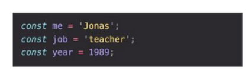
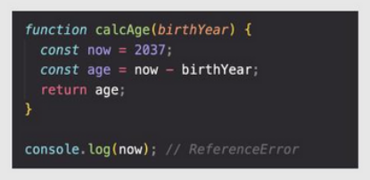
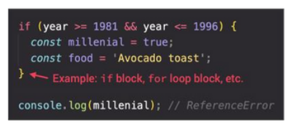

# Scope and Hoisting 
# Scope
## Scope ин областӣ видимости вериейблхо мебошад(Ҷои айёни вериэйблҳо). Яъне ин чое мебошад, ки мо бо вериэйблхо кор карда метавонем. 
## Scopoe 3 хел мешавад: Global scope, function scope ва block scope.
## Global scope: вериэбле ки берун аз conditon, function ва loop меистад global scope номида мешавад. Global scope - ро мо метавонем аз хама чои дилхох фарёд карда бо он кор кунем. 

## function scope - вериэйбле ки да даруни функсия берун  аз функсия кор намекунад function scope номида мешавад. Аз даруни function scope хатто var баромада наметавонад. 

## block scope - вериэбле ки дар даруни loop ва condition бударо меноманд. Ва гайр аз var дигар ягон тагйирёбанда аз даруни block scope баромада намешавад.

## Hosting - Элементхое ки мо пеш аз худаш файрод кунем кор кна hosting номида мешавад
 ## verieble var ва function declaration hosting карда мешавад. Яъне function decloration - ро мо метавонем пеш аз худаш фарёд кунем ва у кори худро пурра ба анчом мерасонад. var хам Hostig карда мешавад ,вале у кори худро пурра накарда дар чавоб undefined мебарорад. 
### Фарқи вериеблхо - вериейбли var ин вериейбли кухна мебошад ва у глобали мебошад ва мо уро гайр аз function scope дигар аз хама чо фарёд карда метавонем. Танхо функсия метавонад var блок кунад. вериейбли const - ро мо танхо як бор киммат дода метавонем ва онро дигар иваз карда наметавонем. Аз хама вериейбли актуалный ин вериейбли let мебошад, ки мо бо он бе ягон мушкили кори худро ба анчом расонем

